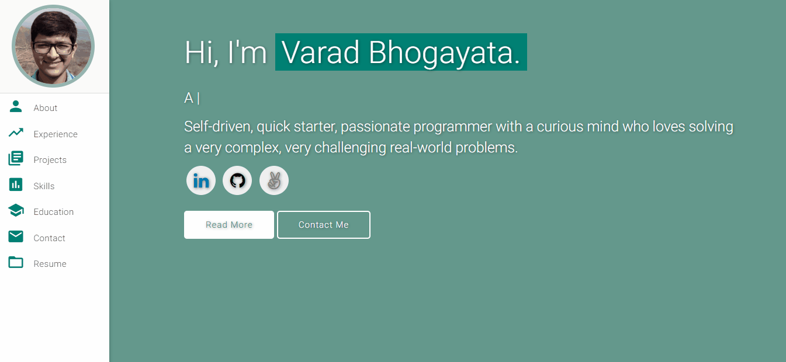

# Personal Portfolio ⚡️ 

https://carlek.github.io

## Sections 📚
✔️ About me\
✔️ Experience\
✔️ Projects \
✔️ Skills \
✔️ Education\
✔️ Contact Info\
✔️ Resume

 

<!-- ### Website Preview -->

 
  <kbd>
    
  </kbd>

Personal Portfoilo is a clean, responsive portfolio template for Software Developers!

## Features 📋
⚡️ Fully Responsive\
⚡️ HTML5 & CSS3\
⚡️ Typing animation using `Typed.js`\
⚡️ Easy to modify

## Installation & Deployment 📦
- Clone/Fork the repository simply modify the content in <b>index.html, assets/ etc.</b>
- Use [Github Pages](https://create-react-app.dev/docs/deployment/#github-pages) to deploy.
- To deploy your website, ensure github repository with name `<your-github-username>.github.io`.
- Push to the `master` branch of this repository.
- <b>NOTE:</b> Make sure to set `analyticsId` from your Google Analytics account inside the Google Analytics script tag, to use your own Google Analytics account.

## Tools Used 🛠️
* [<b>GitHub Pages</b>](https://create-react-app.dev/docs/deployment/#github-pages) - To host my static website (HTML, CSS, JS).
* [<b>Materialize</b>](https://materializecss.com/) - A CSS framework to get Google's Material Design components.
* [<b>Typed.js</b>](https://mattboldt.com/demos/typed-js/) - JavaScript Library

## License 📄
This project is licensed under the MIT License - see the [LICENSE.md](./LICENSE) file for details.
