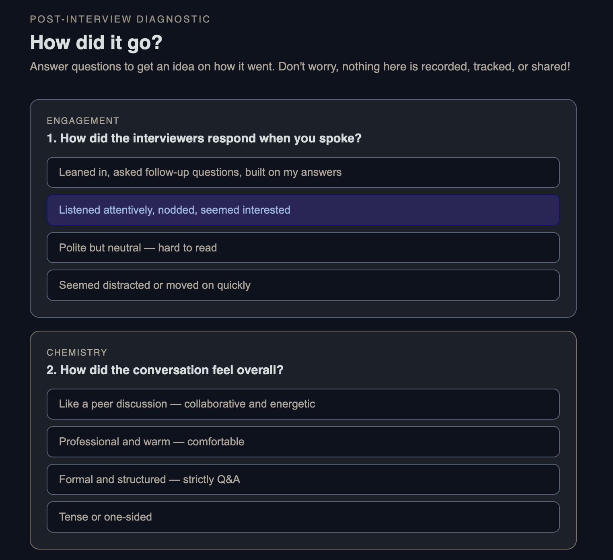
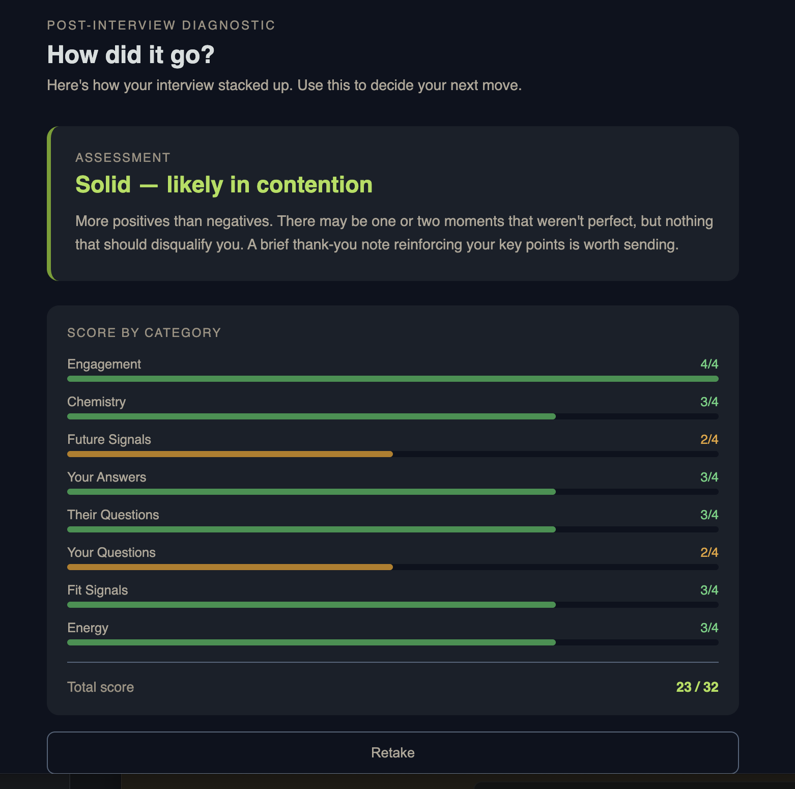

# How Did It Go?

A post-interview self-assessment tool that helps you objectively evaluate how your interview went. Answer eight questions across key signal categories and get a calibrated read on your performance!

## What It Does

After an interview, it's easy to overthink or misjudge how things went. This app walks you through eight diagnostic questions covering:

- **Engagement** -- How interviewers responded when you spoke
- **Chemistry** -- Overall conversational tone and energy
- **Future Signals** -- Whether they discussed next steps or used future tense
- **Your Answers** -- How well your key points landed
- **Their Questions** -- Depth and progression of interviewer questions
- **Your Questions** -- How they engaged with your questions
- **Fit Signals** -- Whether they indicated you were a strong match
- **Energy** -- How you felt when it ended

Each question has four options scored 1--4. Here are the first two:



After completing all eight, you receive:

- An overall assessment (Strong offer signal, Solid, Mixed, or Challenging)
- Actionable commentary on what to do next
- A per-category score breakdown with visual progress bars



## Tech Stack

- React 19 + Vite 8
- Single-component app (no routing, no backend)
- Inline styles, dark theme (slate palette)

## Getting Started

```bash
npm install
npm run dev
```

The app runs at `http://localhost:5173` by default.

## Build

```bash
npm run build
npm run preview
```
